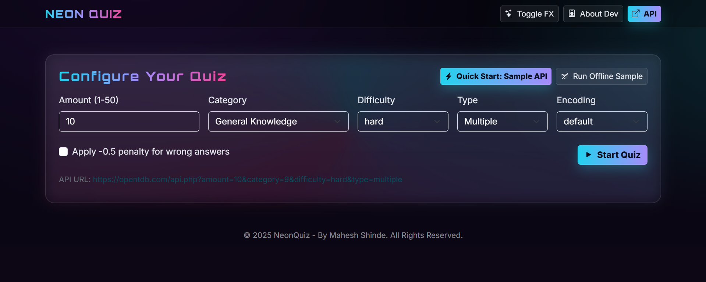
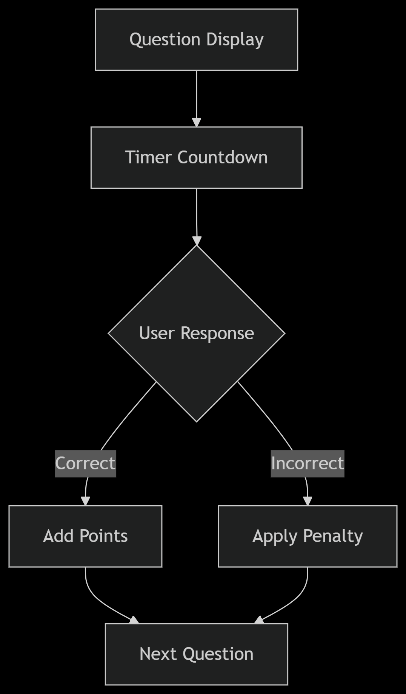
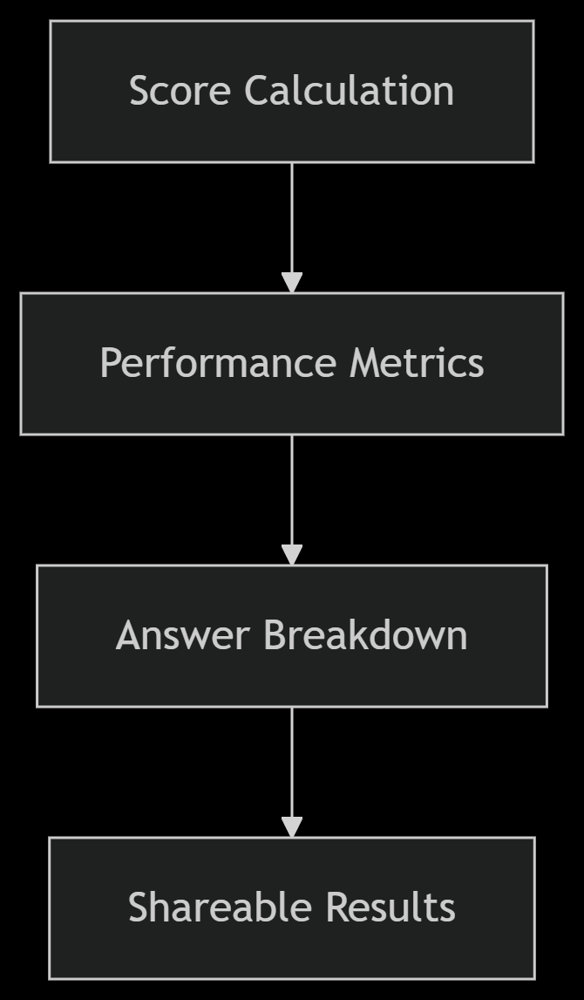

# NeonQuiz — Developed by Mahesh Shinde

  

A futuristic quiz experience with glowing UI elements and real-time analytics, powered by Open Trivia DB.

  
  
  

## Key Features

- **Cyberpunk UI**: Neon gradients, glass cards, animated effects
- **Custom Quizzes**: 24+ categories, 3 difficulty levels
- **Smart Analytics**: Time-based scoring with detailed breakdowns
- **Self-contained**: Single HTML file with zero dependencies

## Workflow

  
  

1. **Configure**: Set questions, category, and difficulty
2. **Play**: Answer against the neon timer
3. **Analyze**: View performance metrics and correct answers

## Technical Highlights

- SVG-powered radial countdown timer
- Responsive glassmorphism design
- Client-side JSON results export
- Automatic API fallback handling

## Developer

**Mahesh Shinde**  
Full-Stack Developer  
[GitHub](https://github.com/maheshshinde9100) | [LinkedIn](https://linkedin.com/in/maheshshinde9100)

*"Built with passion and neon lights"*